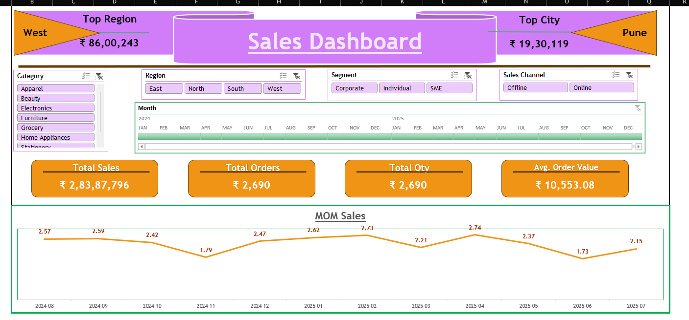

# 🛍️ Retail Sales Dashboard

This Excel dashboard provides a comprehensive view of retail sales performance across regions, product categories, and customer segments. Designed for business leaders and analysts, it enables quick decision-making through dynamic visuals and interactive elements.

## 📌 Business Objective

To analyze sales trends, identify high-performing regions, and uncover opportunities for growth across retail outlets.

## 📊 Key Features

- **Dynamic Region Selection** using slicers
- **PivotTable-driven KPIs**: Total Sales, AOV, Units Sold
- **Interactive Charts**: Monthly trends, category breakdowns
- **Conditional Formatting** for performance flags
- **Branded Layout** with clean visual hierarchy

## 🧠 Insights Delivered

- Top 5 cities contributing to revenue
- Category-wise performance comparison
- Month-on-month growth trends
- Customer segment profitability

## 🛠️ Technical Highlights

- Excel formulas: `SUMIFS`, `IFERROR`, `INDEX-MATCH`
- Linked PivotTables and dynamic chart titles
- Dashboard theme aligned with brand colors
- Optimized for print and presentation

## 📸 Preview

## 📂 File

[Download the Excel Dashboard](Excel_Analytics_Portfolio/Excel_dashboard1/Retail_Sales_Dashboard.xlsx)

---

# 🛍️ Retail Sales Dashboard

This Excel dashboard provides a strategic overview of retail sales performance across cities, categories, and time periods. It’s designed to help business leaders identify growth opportunities, optimize inventory, and track KPIs with ease.

## 📸 Dashboard Preview

## 📥 Download the Dashboard

- [retail_sales_dashboard.xlsx](retail_sales_dashboard.xlsx)

## 🔍 Business Objective

To analyze retail sales trends and uncover actionable insights across geographies and product segments.

## 📊 Key Features

- Region-wise sales breakdown with slicers
- PivotTable-driven KPIs: Revenue, AOV, Units Sold
- Dynamic charts with branded themes
- Conditional formatting for performance flags
- Clean layout optimized for presentation

## 🧠 Insights Delivered

- Top-performing cities and categories
- Month-on-month sales growth
- Customer segment profitability
- Inventory optimization signals

## 🛠️ Technical Highlights

- Excel formulas: `SUMIFS`, `IFERROR`, `INDEX-MATCH`
- Linked PivotTables and dynamic chart titles
- Dashboard theme aligned with brand colors
- Interactive slicers for real-time filtering

---
